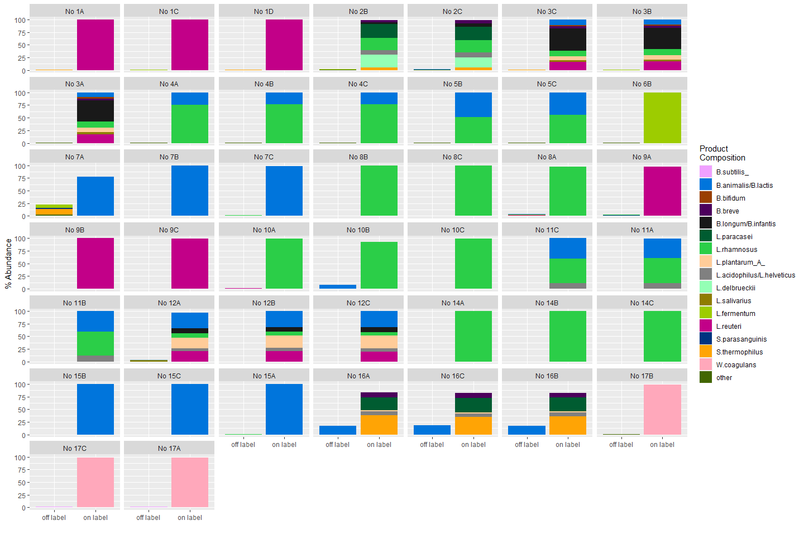
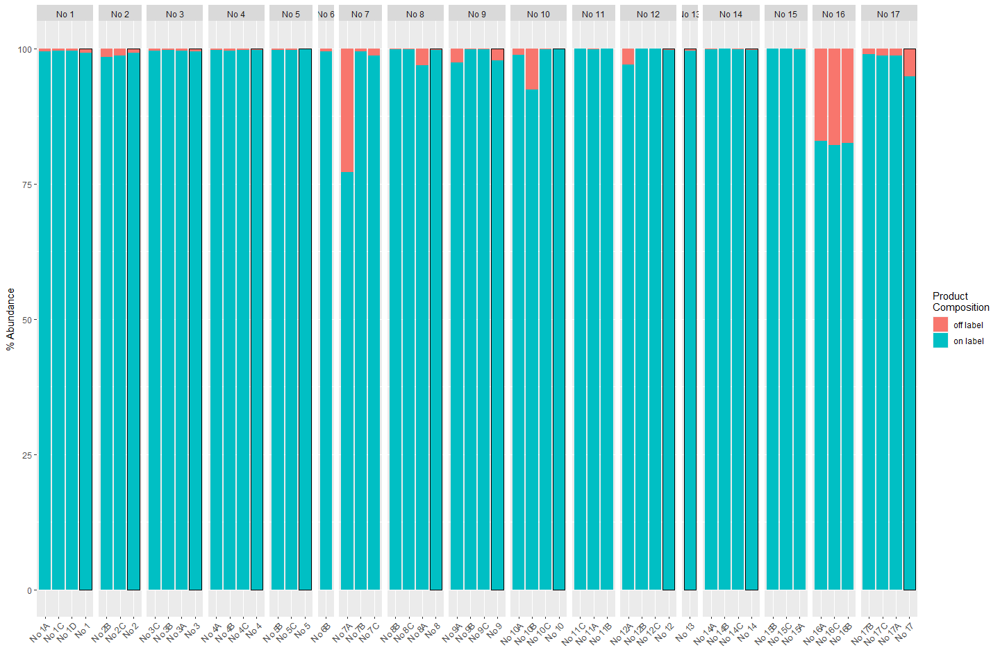
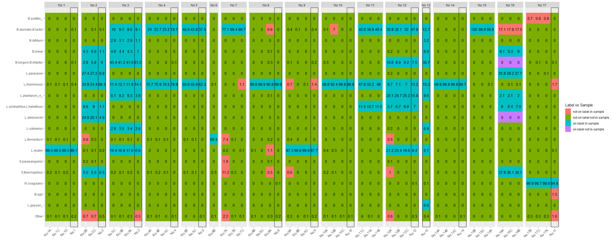

-   [1 Introduction](#introduction)
    -   [1.1 Methods: data generation and
        features](#methods-data-generation-and-features)
-   [2 Data cleanup and formatting](#data-cleanup-and-formatting)
    -   [2.1 Splitting data by abundance](#splitting-data-by-abundance)
-   [3 Data exploration](#data-exploration)
    -   [3.1 Barplot: on vs off label](#barplot-on-vs-off-label)
    -   [3.2 Barplot: on vs off label by product and
        taxa](#barplot-on-vs-off-label-by-product-and-taxa)
    -   [3.3 Heatmap summary: on vs off
        label](#heatmap-summary-on-vs-off-label)
-   [4 Plotting run 1 vs run 2](#plotting-run-1-vs-run-2)
    -   [4.1 Barplot: on vs off label](#barplot-on-vs-off-label-1)
    -   [4.2 Barplot: on vs off label by product and
        taxa](#barplot-on-vs-off-label-by-product-and-taxa-1)
    -   [4.3 Heatmap summary: on vs off
        label](#heatmap-summary-on-vs-off-label-1)

Comparing probiotic composition to their label

# 1 Introduction

Since probiotics in USA are available as dietary supplements, they
bypass the safety, efficacy, and regulatory rigor of the FDA. Thus, the
responsibility for appropriate quality control and safety standards lies
exclusively with manufacturers, allowing probiotic products to evade
regulatory scrutiny. This is some code to take our OTU data, and compare
it the the labels to evaluate whether bacterial strains advertised on
commercial infant probiotic supplements are accurate, and to identify if
any bacterial contaminants are present.

## 1.1 Methods: data generation and features

-   These sequences were collected by extracting DNA from the probiotic
    products and amplifying the V3-V4 region of the 16S gene
    -   There are two sets of data:
        -   Run 1: 16 probiotic products consisting of a mono-, bi-,
            tri- and multi-bug products. Samples were run in triplicate,
            though one sample did not yield any DNA.
        -   Run 2: The same products as above, but using different lot
            numbers and fewer of the samples; more of a confirmatory run
-   We are working with the already processed samples. More information
    in available on how this was done in my [QIIME
    script](https://github.com/kameron-sugino/Basics-of-16S-sequence-processing-with-QIIME-on-SGE-cluster-servers.git)
    and additional annotations were made with my [BLAST
    pipeline](https://github.com/kameron-sugino/BLAST-ing-your-sequence-for-more-specific-taxonomic-IDs.git)
    -   Briefly, sequences were aligned against greengenes2 and any
        unclassified sequences were annotated again using BLAST.
-   Let’s get started by reading in our packages

``` r
require(ggplot2)
```

    ## Loading required package: ggplot2

``` r
require(reshape2)
```

    ## Loading required package: reshape2

``` r
require(colorspace)
```

    ## Loading required package: colorspace

    ## Warning: package 'colorspace' was built under R version 4.1.3

``` r
require(vegan)
```

    ## Loading required package: vegan

    ## Warning: package 'vegan' was built under R version 4.1.3

    ## Loading required package: permute

    ## Warning: package 'permute' was built under R version 4.1.3

    ## Loading required package: lattice

    ## Warning: package 'lattice' was built under R version 4.1.3

    ## This is vegan 2.6-4

``` r
require(dplyr)
```

    ## Loading required package: dplyr

    ## Warning: package 'dplyr' was built under R version 4.1.3

    ## 
    ## Attaching package: 'dplyr'

    ## The following objects are masked from 'package:stats':
    ## 
    ##     filter, lag

    ## The following objects are masked from 'package:base':
    ## 
    ##     intersect, setdiff, setequal, union

# 2 Data cleanup and formatting

-   There are a few things we need to clean up in both run 1 and run 2.
    Here are the features altered for run 1 below:
    -   Renamed sample 5A to 3A (mislabeled)
    -   Average triplicate runs together for downstream analyses
    -   Aggregate the reannotated taxa so there are no duplicate taxa
        names
    -   Since we’re using 16S data, we will have uncertainty surrounding
        closely related species. So we’re combining the following taxa
        into one group:
        -   L.helveticus/L.acidophilus
        -   L.vaginalis/L.reuteri
        -   B.animalis/B.lactis
        -   B.longum/B.infantis

``` r
#need to format run 1 so that the runs arent averaged together
#read in data, rename 5A as 3A
tax<-read.table("C:/Users/ksugino/Desktop/Github_projects/Comparing-probiotic-compositions-to-their-labels/data/run1/taxonomy.tsv",sep="\t",header=T)
df.table<-read.table("C:/Users/ksugino/Desktop/Github_projects/Comparing-probiotic-compositions-to-their-labels/data/run1/table.from_biom.txt",header=F)

id<-df.table[1,-1]

test<-merge(tax,df.table,by.x="Feature.ID",by.y="V1")
tax.n<-test$Taxon

otu.id<-data.frame(t(id),t(test[,-c(1:3)]))
colnames(otu.id)<-c("id",tax.n)

#rename 5A to 3A
otu.id[32,1]<-"3A"

#split data for later use
otu<-sapply(otu.id[,-1], as.numeric)
id<-otu.id$id
tax<-colnames(otu)

#sort lists
# otu.ag<-aggregate(x = otu, by = list(gsub("A|B|C|D","",id)), FUN = mean)
ra<-otu/rowSums(otu)*100
ra<-data.frame(id,ra)

#transpose ra to sum columns with the same species designation
ra.t<-t(ra[,-1])
taxa.t<-ifelse(nchar(gsub(".*s__","",rownames(ra.t)))<5,gsub(".*f__","",rownames(ra.t)),gsub(".*s__","",rownames(ra.t)))
taxa.t<-gsub("\\.[0-9]|[0-9]","",taxa.t)

ra.t.ag<-aggregate(ra.t,list(taxa.t),sum)

test<-data.frame(ra[,1],t(ra.t.ag[,-1]))
colnames(test)<-c("id",ra.t.ag[,1])
ra<-test

#reannotating using BLAST results
#need to combine L.helveticus/L.acidophilus (keep name as acidophilus for now, rename later), crispatus also likely acidophilus
ra$Lactobacillus.acidophilus<-ra$Lactobacillus.acidophilus+ra$Lactobacillus.helveticus+ra$Lactobacillus.crispatus
ra<-ra[,-which(colnames(ra)%in%c("Lactobacillus.helveticus","Lactobacillus.crispatus"))]

#these sequences map to reuteri
ra$Limosilactobacillus.reuteri<-ra$Lactobacillaceae..g__Limosilactobacillus..s__+ra$Limosilactobacillus.reuteri+ra$Limosilactobacillus.vaginalis
ra<-ra[,-which(colnames(ra)%in%c("Lactobacillaceae..g__Limosilactobacillus..s__","Limosilactobacillus.vaginalis"))]

#these sequences map to thermophilus
ra$Streptococcus.thermophilus<-ra$Streptococcus.thermophilus+ra$Streptococcaceae..g__Streptococcus..s__
ra<-ra[,-which(colnames(ra)=="Streptococcaceae..g__Streptococcus..s__")]

#refactor bacterial names to first letter of the genus and full species name
taxa.name<-gsub("","",colnames(ra[,-1]))
colnames(ra)<-c("id",paste0(sub("(.)[^ ]*", "\\1", taxa.name),".",gsub(".*\\.","",taxa.name)))

#rename animalis to animalis/lactis, longum/infantis, acidophilus/helveticus
colnames(ra)[which(colnames(ra)%in%c("B.animalis","B.longum","L.acidophilus"))]<-c("B.animalis/B.lactis","B.longum/B.infantis","L.acidophilus/L.helveticus")

df.prob.list<-read.csv("C:/Users/ksugino/Desktop/Github_projects/Comparing-probiotic-compositions-to-their-labels/data/run1/221006_Probiotics Master List_table.csv")

# relative abundance of OTUs
ra$unique<-ra$id
ra$id<-gsub("A|B|C|D","",ra$unique)

df.m.list<-merge(df.prob.list,ra,by.x="Number",by.y="id")
#remove non-unique identifier
df.m.list$Number<-df.m.list$unique
df.m.list<-df.m.list[,-which(colnames(df.m.list)=="unique")]

ra.sort<-df.m.list[,-c(1:ncol(df.prob.list))]
list.sort<-df.m.list[,c(1:ncol(df.prob.list))]
#make aggregate df
ra.sort.agg<-aggregate(ra.sort, list(list.sort$Brand),mean)
```

## 2.1 Splitting data by abundance

-   Since we’re only interested in taxa that are on the product label,
    and since we expect those taxa to have the highest abundance, we can
    sum the lower abundance taxa into an “other” category to save space

``` r
top.ra<-ra.sort[,apply(ra.sort, 2, function(x) max(x, na.rm = TRUE))>=0.5]
bot.ra<-ra.sort[,apply(ra.sort, 2, function(x) max(x, na.rm = TRUE))<0.5]

ra.new<-data.frame(top.ra,rowSums(bot.ra))
colnames(ra.new)<-c(colnames(top.ra),"Other")
ra.new<-data.frame(list.sort[,c(1:2)],ra.new)

write.csv(ra.new,"C:/Users/ksugino/Desktop/Github_projects/Comparing-probiotic-compositions-to-their-labels/data/run1/20231214_ra_unmerged_gg2_BLAST_names_table.csv",row.names = F)
```

# 3 Data exploration

-   Let’s start looking at the data now. We’ll generate the following
    plots:
    -   barplot of on vs off label
    -   faceted plot of taxa on the label ve taxa off the label for each
        product
    -   heatmap summary

## 3.1 Barplot: on vs off label

``` r
#refactor label info
l<-list.sort[,-c(1:2)]
l.n<-colnames(l)

onoffsum<-data.frame(paste("No",ra.new$Number),top.ra,rowSums(bot.ra))
colnames(onoffsum)<-c("id",colnames(top.ra),"other")

onoffsum.melt<-melt(onoffsum, id.vars = 1)
onoffsum.melt$id<-factor(onoffsum.melt$id,levels=unique(onoffsum.melt$id))
store.melt<-onoffsum.melt
id.list<-unique(onoffsum.melt$id)

#make column for on vs off label for each taxa/sample pair
onoffsum.melt$label<-NA
for(i in 1:length(id.list)){
  num<-which(onoffsum.melt$id==unique(onoffsum.melt$id)[i])
  onoffsum.melt$label[num]<-ifelse(grepl(gsub("\\.","|",paste(gsub(".*\\.\\.","",l.n[l[i,]==T]),collapse = "|")),onoffsum.melt$variable[num],ignore.case = T)
                                   ,"on label","off label")
}
ggplot(onoffsum.melt, aes(fill=label, y=value, x=id)) + 
  geom_bar(position="stack", stat="identity")+
  labs(x ="", y = "% Abundance",fill="Product \nComposition")+
  theme(axis.text.x = element_text(angle = 45, vjust = 1, hjust=1))+
  facet_grid(. ~ factor(gsub("A|B|C|D","",id),levels=c("No 1","No 2","No 3","No 4","No 5","No 6","No 7","No 8","No 9","No 10","No 11","No 12","No 14","No 15","No 16","No 17")), drop=TRUE,scale="free",space="free_x")
```


## 3.2 Barplot: on vs off label by product and taxa

``` r
#order sample number, variables and create colors
require(pals)
```

    ## Loading required package: pals

``` r
onoffsum.melt$id <- factor(onoffsum.melt$id,levels=unique(as.character(onoffsum.melt$id)))
onoffsum.melt$variable <- factor(onoffsum.melt$variable,levels = unique(as.character(onoffsum.melt$variable)))
onoffsum.melt$col<-onoffsum.melt$variable
on.col<-unname(alphabet())[c(1:length(unique(onoffsum.melt$col)))]

ggplot(onoffsum.melt, aes(fill=variable, y=value, x=label)) + 
  geom_bar(position="stack", stat="identity")+
  scale_fill_manual(values = on.col)+
  facet_wrap(~id)+
  labs(x ="", y = "% Abundance",fill="Product \nComposition")
```



## 3.3 Heatmap summary: on vs off label

``` r
#heatmap showing present/absent/should be present
pres.table<-ifelse(ra.sort>0.5,T,F)
names.table<-gsub("\\.\\.\\..*","",colnames(pres.table))
names.table<-gsub(".*\\.","",names.table)

onoffsum.melt2<-store.melt

onoffsum.melt2$onlabel<-NA
for(i in 1:length(id.list)){
  num<-which(onoffsum.melt2$id==unique(onoffsum.melt2$id)[i]) #grabs the location of each sample in the melt table
  onoffsum.melt2$onlabel[num]<-grepl(gsub("\\.","|",paste(gsub(".*\\.\\.","",l.n[l[i,]==T]),collapse = "|")),onoffsum.melt2$variable[num],ignore.case = T)
}

onoffsum.melt2$onlabel[num]<-grepl(gsub("\\.","|",paste(gsub(".*\\.\\.","",l.n[l[i,]==T]),collapse = "|")),onoffsum.melt2$variable[num],ignore.case = T)

onoffsum.melt2$insample<-ifelse(onoffsum.melt2$value>0.5,T,F)

onoffsum.melt2$onoff.final<-ifelse(onoffsum.melt2$onlabel==T&onoffsum.melt2$insample==T,"on label in sample",ifelse(onoffsum.melt2$onlabel==F&onoffsum.melt2$insample==T,"not on label in sample",ifelse(onoffsum.melt2$onlabel==T&onoffsum.melt2$insample==F,"on label not in sample","not on label not in sample")))

onoffsum.melt2$id <- factor(onoffsum.melt2$id,levels=unique(as.character(onoffsum.melt2$id)))
onoffsum.melt2$variable <- factor(onoffsum.melt2$variable,levels = unique(as.character(onoffsum.melt2$variable)))

ggplot(onoffsum.melt2, aes(y=forcats::fct_rev(variable), x=id, fill=factor(onoff.final))) + 
  geom_tile()+
  geom_text(aes(label = round(value, 1)))+
  xlab("")+
  ylab("")+
  labs(fill="Label vs Sample")+
  theme(axis.text.x = element_text(angle = 45, vjust = 1, hjust=1))+
  facet_grid(. ~ factor(gsub("A|B|C|D","",id),levels=c("No 1","No 2","No 3","No 4","No 5","No 6","No 7","No 8","No 9","No 10","No 11","No 12","No 14","No 15","No 16","No 17")), drop=TRUE,scale="free",space="free_x")
```


# 4 Plotting run 1 vs run 2

-   Now we want to plot run 2 next to run 1 to compare the two outputs

``` r
run1<-read.csv("C:/Users/ksugino/Desktop/Github_projects/Comparing-probiotic-compositions-to-their-labels/data/run1/20231214_ra_unmerged_gg2_BLAST_names_table.csv")

#Note: this file was not created here
run2<-read.csv("C:/Users/ksugino/Desktop/Github_projects/Comparing-probiotic-compositions-to-their-labels/data/run2/20231214_ra_gg2_BLAST_names_table.csv")

run1<-data.frame(run1[,c(1:2)],"run1",run1[,-c(1:2)])
colnames(run1)<-c(colnames(run1[,c(1:2)]),"run",colnames(run1[,-c(1:3)]))
run_1_agg<-data.frame(rep("run1",16),aggregate(run1[,-c(1:3)],list(run1$Brand),mean))
colnames(run_1_agg)<-c("run","Brand",colnames(run_1_agg[,-c(1:2)]))

run2<-data.frame(run2[,c(1:2)],"run2",run2[,-c(1:2)])
colnames(run2)<-c(colnames(run2[,c(1:2)]),"run",colnames(run2[,-c(1:3)]))
run2$Number<-as.character(run2$Number)

#merge with dplyr
runs_m<-bind_rows(run1,run2)
runs_m[is.na(runs_m)]<-0

runs_m_agg<-bind_rows(run_1_agg,run2[,-1])
runs_m_agg[is.na(runs_m_agg)]<-0

################################
################################
temp_runs<-runs_m

#temp_runs<-runs_m_agg

#refactor id's to order run 1 then run 2 when run 2 had data
merged_runs<-temp_runs[order(as.numeric(gsub("[A-Z]","",temp_runs$Number))),]
#refactor columns so that other is at the end
temp<-data.frame(merged_runs[,c(1:(which(colnames(merged_runs)=="Other")-1))],merged_runs[,c((which(colnames(merged_runs)=="Other")+1):ncol(merged_runs))],merged_runs[,c(which(colnames(merged_runs)=="Other"))])
names(temp)[ncol(temp)]<-"Other"

merged_runs<-temp

#read in each run's list of on/off label and merge
list.sort.r1<-read.csv("C:/Users/ksugino/Desktop/Github_projects/Comparing-probiotic-compositions-to-their-labels/data/run1/master_list_sorted.csv")
list.sort.r2<-read.csv("C:/Users/ksugino/Desktop/Github_projects/Comparing-probiotic-compositions-to-their-labels/data/run2/master_list_sorted.csv")
list.sort.r2$Number<-as.character(list.sort.r2$Number)

#refactor list to match merged_runs
list.temp<-bind_rows(list.sort.r1,list.sort.r2)
list.sort<-list.temp[order(as.numeric(gsub("[A-Z]","",list.temp$Number))),]
list.sort[is.na(list.sort)]<-FALSE

l<-list.sort[,-c(1:2)]
l.n<-colnames(l)

onoffsum<-data.frame(paste("No",merged_runs$Number),merged_runs[,-c(1:3)])
colnames(onoffsum)<-c("id",colnames(merged_runs[,-c(1:3)]))

#mean of onoffsum
df_agg<-aggregate(onoffsum[,-1],list(list.sort$Brand),mean)

require(ggplot2)
require(reshape2)
onoffsum.melt<-melt(onoffsum, id.vars = 1)
onoffsum.melt$id<-factor(onoffsum.melt$id,levels=unique(onoffsum.melt$id))
store.melt<-onoffsum.melt
id.list<-unique(onoffsum.melt$id)

#gotta make the column then fill it
onoffsum.melt$label<-NA
for(i in 1:length(id.list)){
  num<-which(onoffsum.melt$id==unique(onoffsum.melt$id)[i])
  onoffsum.melt$label[num]<-ifelse(grepl(gsub("\\.","|",paste(gsub(".*\\.\\.","",l.n[l[i,]==T]),collapse = "|")),onoffsum.melt$variable[num],ignore.case = T)
                                   ,"on label","off label")
}
```

## 4.1 Barplot: on vs off label

``` r
ggplot(onoffsum.melt, aes(fill=label, y=value, x=id)) + 
  geom_bar(position="stack",  stat="identity")+
  labs(x ="", y = "% Abundance",fill="Product \nComposition")+
  theme(axis.text.x = element_text(angle = 45, vjust = 1, hjust=1))+
  
  facet_grid(. ~ factor(gsub("A|B|C|D","",id),
            levels=c("No 1","No 2","No 3","No 4","No 5",
                     "No 6","No 7","No 8","No 9","No 10",
                     "No 11","No 12", "No 13","No 14",
                     "No 15","No 16","No 17")), 
            drop=TRUE,scale="free",space="free_x")+
  
  stat_summary(aes(x = id, y = value),
               fun.y = sum,
               geom = "col",
               colour = ifelse(grepl("A|B|C|D",unique(onoffsum.melt$id)),0,1),
               fill = ifelse(grepl("A|B|C|D",unique(onoffsum.melt$id)),NA,NA))
```

    ## Warning: The `fun.y` argument of `stat_summary()` is deprecated as of ggplot2 3.3.0.
    ## i Please use the `fun` argument instead.
    ## This warning is displayed once every 8 hours.
    ## Call `lifecycle::last_lifecycle_warnings()` to see where this warning was
    ## generated.



``` r
  # cant get the boxes to outline or insert a shape parameter because I'm not calling the data in an aes statement correctly
  # geom_segment(aes(xend = id, yend = ifelse(grepl("A|B|C|D",id),0,1),linetype=ifelse(grepl("A|B|C|D",id),"Run 1","Run 2")),linewidth=NA, colour = ifelse(grepl("A|B|C|D",onoffsum.melt$id),0,1))+
  # 
  # scale_linetype_manual(values = c(1,2), name = "Sequencing \nRun")
```

## 4.2 Barplot: on vs off label by product and taxa

``` r
#order sample number, variables and create colors
require(pals)
onoffsum.melt$id <- factor(onoffsum.melt$id,levels=unique(as.character(onoffsum.melt$id)))
onoffsum.melt$variable <- factor(onoffsum.melt$variable,levels = unique(as.character(onoffsum.melt$variable)))
onoffsum.melt$col<-onoffsum.melt$variable
on.col<-unname(alphabet())[c(1:length(unique(onoffsum.melt$col)))]

ggplot(onoffsum.melt, aes(fill=variable, y=value, x=label)) + 
  geom_bar(position="stack", stat="identity")+
  scale_fill_manual(values = on.col)+
  facet_wrap(~id)+
  labs(x ="", y = "% Abundance",fill="Product \nComposition")
```


## 4.3 Heatmap summary: on vs off label

``` r
#heatmap showing present/absent/should be present
pres.table<-ifelse(ra.sort>0.5,T,F)
names.table<-gsub("\\.\\.\\..*","",colnames(pres.table))
names.table<-gsub(".*\\.","",names.table)

onoffsum.melt2<-store.melt

onoffsum.melt2$onlabel<-NA
for(i in 1:length(id.list)){
  num<-which(onoffsum.melt2$id==unique(onoffsum.melt2$id)[i]) #grabs the location of each sample in the melt table
  onoffsum.melt2$onlabel[num]<-grepl(gsub("\\.","|",paste(gsub(".*\\.\\.","",l.n[l[i,]==T]),collapse = "|")),onoffsum.melt2$variable[num],ignore.case = T)
}

onoffsum.melt2$onlabel[num]<-grepl(gsub("\\.","|",paste(gsub(".*\\.\\.","",l.n[l[i,]==T]),collapse = "|")),onoffsum.melt2$variable[num],ignore.case = T)

onoffsum.melt2$insample<-ifelse(onoffsum.melt2$value>0.5,T,F)

onoffsum.melt2$onoff.final<-ifelse(onoffsum.melt2$onlabel==T&onoffsum.melt2$insample==T,"on label in sample",ifelse(onoffsum.melt2$onlabel==F&onoffsum.melt2$insample==T,"not on label in sample",ifelse(onoffsum.melt2$onlabel==T&onoffsum.melt2$insample==F,"on label not in sample","not on label not in sample")))


onoffsum.melt2$id <- factor(onoffsum.melt2$id,levels=unique(as.character(onoffsum.melt2$id)))
onoffsum.melt2$variable <- factor(onoffsum.melt2$variable,levels = unique(as.character(onoffsum.melt2$variable)))

ggplot(onoffsum.melt2, aes(y=forcats::fct_rev(variable), x=id, fill=factor(onoff.final))) + 
  geom_tile()+
  geom_text(aes(label = round(value, 1)))+
  xlab("")+
  ylab("")+
  labs(fill="Label vs Sample")+
  theme(axis.text.x = element_text(angle = 45, vjust = 1, hjust=1))+
  
  facet_grid(. ~ factor(gsub("A|B|C|D","",id),
                        levels=c("No 1","No 2","No 3","No 4","No 5",
                                 "No 6","No 7","No 8","No 9","No 10",
                                 "No 11","No 12", "No 13","No 14",
                                 "No 15","No 16","No 17")), 
             drop=TRUE,scale="free",space="free_x")+
  
  stat_summary(aes(x = id, y = 1.05),
               fun.y = sum,
               geom = "col",
               colour = ifelse(grepl("A|B|C|D",unique(onoffsum.melt$id)),0,1),
               fill = ifelse(grepl("A|B|C|D",unique(onoffsum.melt$id)),NA,NA))
```


